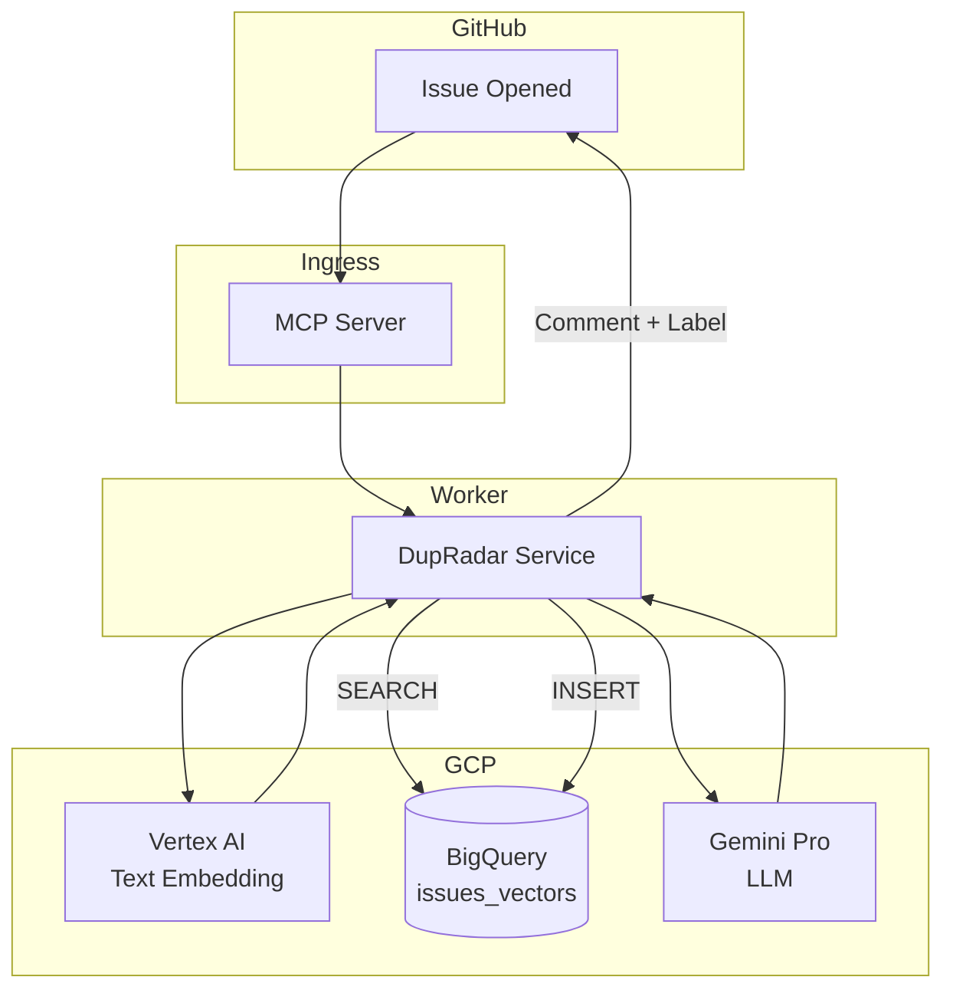

<!-- これは下書きです。内容は適宜変更します。 -->

# DupRadar

DupRadar は、**Vertex AI** と **BigQuery Vector Search** を活用して、新しく作成された GitHub Issue の重複を自動検出し、さらに内容を整理して開発者と投稿者双方の負担を軽減する GitHub Bot です。

---

## 特徴

- **重複 Issue の検出**  
  新規 Issue を Vertex AI の `text-embedding‑005` でベクトル化し、BigQuery の `VECTOR_SEARCH()` で既存 Issue と類似度比較。類似度が高い Issue をコメントとして提示します。
- **Issue のリファイン**  
  Gemini Pro が「再現手順」「期待結果」「実際結果」などを抽出し、テンプレート化した読みやすい本文を生成。投稿者に改善案を提示します。
- **ラベル自動付与 & 通知**  
  `duplicate?` や `needs-triage` などのラベルを自動設定し、開発者が必要な対応をすぐ判断できるよう支援します。
- **Go / Rust 実装**  
  公式 SDK を利用した軽量・高速なバイナリで、オンプレ・クラウドどちらにも容易にデプロイ可能です。
- **安全な Webhook 受信**  
  GitHub MCP Server と Cloudflare Tunnel を組み合わせ、社内ネットワークでも安全に GitHub Webhook を受信できます。

---

## アーキテクチャ



---

## クイックスタート

### 前提条件

| ツール | 推奨バージョン例 |
|-------|------------------|
| Go または Rust | Go 1.22 / Rust 1.78 |
| gcloud CLI | 474.0.0 以上 |
| MCP Server | `ghcr.io/github/mcp-server:latest` |
| GCP API | BigQuery API / Vertex AI API が有効化済み |

### 1. BigQuery テーブル & インデックス作成

```sql
CREATE TABLE
  `myproj.github.issues_vectors` ( repo STRING,
    issue_id INT64,
    title STRING,
    body STRING,
    created_at TIMESTAMP,
    embedding ARRAY<FLOAT64> );
CREATE VECTOR INDEX
  idx_issue_embedding
ON
  `myproj.github.issues_vectors` (embedding) OPTIONS(index_type = 'IVF');
```

### 2. シークレット設定

| 変数 | 説明 |
|------|------|
| `GITHUB_APP_ID` / `GITHUB_PRIVATE_KEY` | GitHub App 認証情報 |
| `GH_WEBHOOK_SECRET` | Webhook 署名検証用シークレット |
| `GOOGLE_APPLICATION_CREDENTIALS` | サービスアカウントの JSON キー |

`.env.sample` をコピーして環境変数を設定してください。

### 3. ビルド & 実行（Go 版）

```bash
go build -o dupradar ./cmd/server
./dupradar
```

デフォルトで `:8080/webhook` をリッスンします。MCP Server から同パスへ転送してください。

---

## ディレクトリ構成

```
.
├── cmd/
│   └── server/           # main()
├── internal/
│   ├── github/           # GitHub API ラッパー
│   ├── vertex/           # Embedding / Gemini 呼び出し
│   ├── bigquery/         # 検索・挿入処理
│   └── triage/           # 類似度計算・コメント生成
├── deploy/
│   ├── cloudrun/         # Cloud Run 用マニフェスト
│   └── k8s/              # Kubernetes マニフェスト
└── README.md
```

---

## ロードマップ

- [ ] PR / Discussion への対応拡張
- [ ] 類似度が閾値以上の場合の自動クローズ
- [ ] OpenTelemetry 対応（トレース・メトリクス）
- [ ] Rust 実装版 (`crates/dupradar`) の公開
- [ ] Slack / Discord 通知プラグイン

---

## 開発・コントリビュート

1. リポジトリを Fork し、ローカルに clone します。
2. `make dev` でホットリロードサーバを起動します。
3. プルリクエストは *small, focused, tested* でお願いします。
4. `make lint test` が CI と同一設定です。

---

## ライセンス

Apache License 2.0  
GiHub API および GCP サービスの利用規約を遵守してください。

